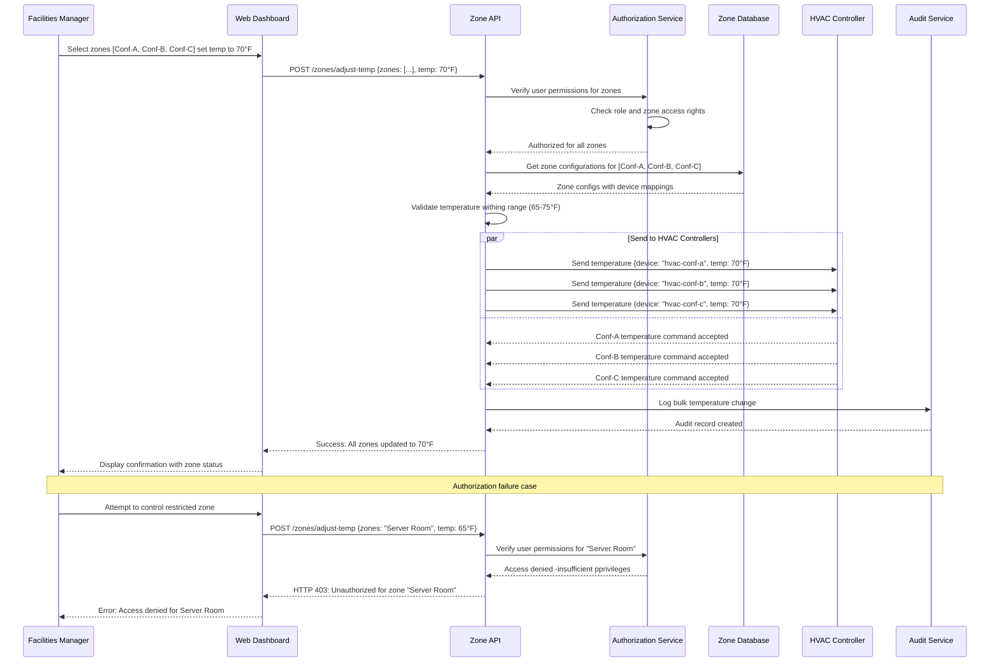

```mermaid
sequenceDiagram
    participant FM as Facilities Manager
    participant WD as Web Dashboard
    participant ZA as Zone API
    participant AS as Authorization Service
    participant ZBD as Zone Database
    participant HC as HVAC Controller
    participant AUD as Audit Service

    FM->>WD: Select zones [Conf-A, Conf-B, Conf-C] set temp to 70°F
    WD->>ZA: POST /zones/adjust-temp {zones: [...], temp: 70°F}
    ZA->>AS: Verify user permissions for zones
    AS->>AS: Check role and zone access rights
    AS -->>ZA: Authorized for all zones

    ZA->>ZBD: Get zone configurations for [Conf-A, Conf-B, Conf-C]
    ZBD-->>ZA: Zone configs with device mappings
    ZA->>ZA: Validate temperature withing range (65-75°F)

    par Send to HVAC Controllers
        ZA->>HC: Send temperature {device: "hvac-conf-a", temp: 70°F}
        ZA->>HC: Send temperature {device: "hvac-conf-b", temp: 70°F}
        ZA->>HC: Send temperature {device: "hvac-conf-c", temp: 70°F}
    and 
        HC-->>ZA: Conf-A temperature command accepted
        HC-->>ZA: Conf-B temperature command accepted
        HC-->>ZA: Conf-C temperature command accepted
    end
    ZA->>AUD: Log bulk temperature change
    AUD-->>ZA: Audit record created
    ZA-->>WD: Success: All zones updated to 70°F
    WD-->>FM: Display confirmation with zone status

    Note over FM,AUD: Authorization failure case
    FM->>WD: Attempt to control restricted zone
    WD->>ZA: POST /zones/adjust-temp {zones: "Server Room", temp: 65°F}
    ZA->>AS: Verify user permissions for "Server Room"
    AS-->>ZA: Access denied -insufficient pprivileges
    ZA-->>WD: HTTP 403: Unauthorized for zone "Server Room"
    WD-->>FM: Error: Access denied for Server Room
```