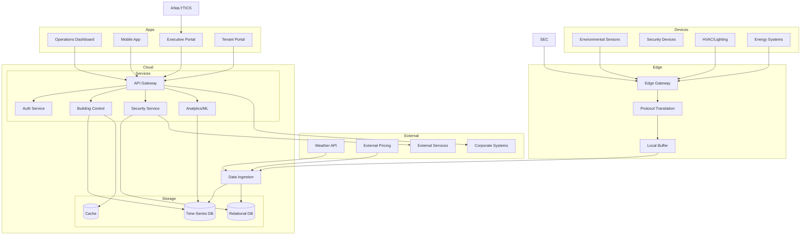

```mermaid
graph TB
    subgraph External
        WS[Weather API]
        EP[External Pricing]
        ES[External Services]
        CORP[Corporate Systems]
    end

    subgraph Devices
        SENS[Environmental Sensors]
        SECT[Security Devices]
        HVAC[HVAC/Lighting]
        ENERGY[Energy Systems]
    end

    subgraph Edge
        GW[Edge Gateway]
        TRANS[Protocol Translation]
        BUFF[Local Buffer]
    end

    subgraph Cloud
        INGEST[Data Ingestion]

        subgraph Services
            API[API Gateway]
            AUTH[Auth Service]
            HVAC_SVC[Building Control]
            SEC_SVC[Security Service]
            ANALYTICS[Analytics/ML]
        end

        subgraph Storage
            TSDB[(Time-Series DB)]
            RDB[(Relational DB)]
            CACHE[(Cache)]
        end
    end

    subgraph Apps
        OPS[Operations Dashboard]
        MOBILE[Mobile App]
        EXEC[Executive Portal]
        TENANT[Tenant Portal]
    end

    %% Device to Edge
    SENS --> GW
    SEC --> GW
    HVAC --> GW
    ENERGY --> GW

    %% Edge Processing
    GW --> TRANS
    TRANS --> BUFF
    BUFF --> INGEST

    %% External Data
    WS --> INGEST
    EP --> INGEST

    %% Data Flow to Storage
    INGEST --> TSDB
    INGEST --> RDB

    %% App Layer
    OPS --> API
    MOBILE --> API
    EXEC --> API
    TENANT --> API

    %% API routing
    API --> AUTH
    API --> HVAC_SVC
    API --> SEC_SVC
    API --> ANALYTICS

    %% Service data access
    HVAC_SVC --> TSDB
    SEC_SVC --> RDB
    ANALYTICS --> TSDB
    HVAC_SVC --> CACHE

    %% External intgerations
    SEC_SVC --> ES
    API --> CORP

    %% Analytics outputs
    ANaLYTICS --> EXEC
```
