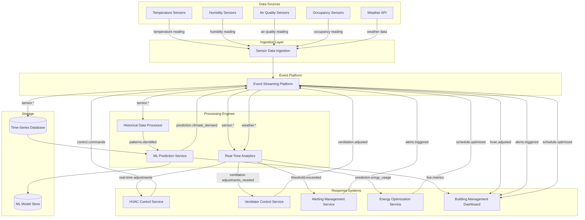

```mermaid
graph TD
    subgraph Data Sources
        TS[Temperature Sensors]
        HS[Humidity Sensors]  
        AQ[Air Quality Sensors]
        OS[Occupancy Sensors]
        WX[Weather API]
    end
    subgraph Ingestion Layer
        SDI[Sensor Data Ingestion]
    end
    subgraph Event Platform
        ESP[Event Streaming Platform]
    end

    subgraph Processing Engines
        RTA[Real-Time Analytics]
        HDP[Historical Data Processor]
        MLP[ML Prediction Service]
    end

    subgraph Response Systems
        HCS[HVAC Control Service]
        VCS[Ventilator Control Service]
        AMS[Alerting Management Service]
        EOS[Energy Optimization Service]
        BMD[Building Management Dashboard]
    end

    subgraph Storage
        TSBD[(Time-Series Database)]
        ML_Store[(ML Model Store)]
    end

    %% Data ingestion flows
    TS --> |temperature reading| SDI
    HS --> |humidity reading| SDI
    AQ --> |air quality reading| SDI
    OS --> |occupancy reading| SDI
    WX --> |weather data| SDI

    SDI --> ESP

    %% Real-time processing 
    ESP --> |sensor.*|RTA
    ESP --> |weather.*|RTA

    %% Historical processing
    ESP --> |sensor.*|HDP
    ESP --> |sensor.*|TSBD

    %% ML processing
    HDP --> |patterns.idenitifed| MLP
    TSBD --> MLP
    MLP --> ML_Store

    %% Response flows
    RTA --> |real-time adjustments| HCS
    RTA --> |ventilation adjustments_needed| VCS
    RTA --> |threshold.exceeded| AMS
    RTA --> |live.metrics| BMD

    MLP --> |prediction.climate_demand| ESP
    MLP --> |prediction.enrgy_usage| EOS

    %% Secondary event flows
    HCS --> |control.commands| ESP
    VCS --> |ventilation.adjusted| ESP
    AMS --> |alerts.triggered| ESP
    EOS --> |schedule.optimized| ESP

    %% Dashboard updates
    ESP --> |hvac.adjusted| BMD
    ESP --> |alerts.triggered| BMD
    ESP --> |schedule.optimized| BMD

```