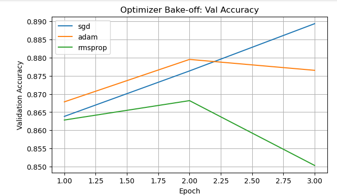
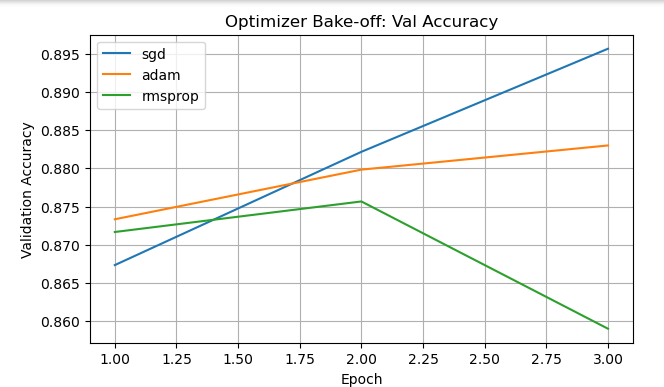
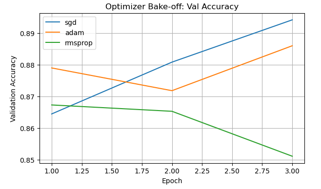
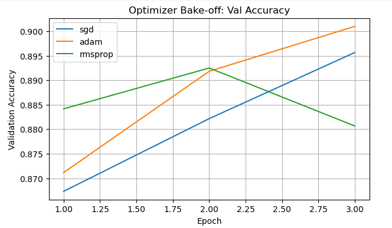
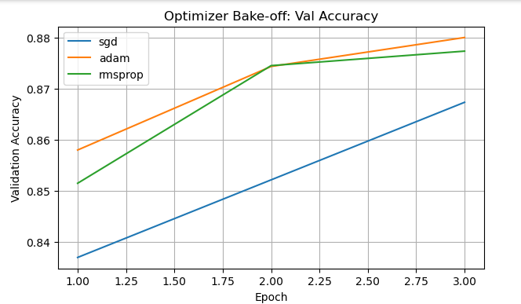

# Purpose of this Folder

This folder should contain the starter code and instructions for the exercise.

# Optimizer configurations No. 1
### Weight Decay set to 1e-3
optim_cfgs = {
    'sgd':     {'lr': 1e-2, 'momentum': 0.9, 'weight_decay': 1e-3},
    'adam':    {'lr': 1e-2, 'betas': (0.9, 0.999),    'weight_decay': 1e-3},
    'rmsprop': {'lr': 1e-2, 'alpha': 0.9,    'weight_decay': 1e-3},
}

# Results
=== Training with SGD ===
Epoch 01 | train loss 0.5590 acc 0.7958 | val loss 0.3747 acc 0.8638
Epoch 02 | train loss 0.3507 acc 0.8719 | val loss 0.3391 acc 0.8763
Epoch 03 | train loss 0.3078 acc 0.8869 | val loss 0.2930 acc 0.8893

=== Training with ADAM ===
Epoch 01 | train loss 0.4764 acc 0.8258 | val loss 0.3598 acc 0.8678
Epoch 02 | train loss 0.3890 acc 0.8586 | val loss 0.3330 acc 0.8795
Epoch 03 | train loss 0.3744 acc 0.8627 | val loss 0.3315 acc 0.8765

=== Training with RMSPROP ===
Epoch 01 | train loss 0.5580 acc 0.8013 | val loss 0.3769 acc 0.8628
Epoch 02 | train loss 0.4271 acc 0.8442 | val loss 0.3570 acc 0.8682
Epoch 03 | train loss 0.4129 acc 0.8490 | val loss 0.4077 acc 0.8503

Done training all optimizers.

## Best Optimizer
Best by val acc: sgd
Test accuracy with SGD: 0.8875

# Optimizer configurations No. 2
### Weigth Decay set to 1e-4
optim_cfgs = {
    'sgd':     {'lr': 1e-2, 'momentum': 0.9, 'weight_decay': 1e-4},
    'adam':    {'lr': 1e-2, 'betas': (0.9, 0.999),    'weight_decay': 1e-4},
    'rmsprop': {'lr': 1e-2, 'alpha': 0.9,    'weight_decay': 1e-4},
}

# Results

=== Training with SGD ===
Epoch 01 | train loss 0.5561 acc 0.7971 | val loss 0.3712 acc 0.8673
Epoch 02 | train loss 0.3445 acc 0.8734 | val loss 0.3269 acc 0.8822
Epoch 03 | train loss 0.2980 acc 0.8901 | val loss 0.2853 acc 0.8957

=== Training with ADAM ===
Epoch 01 | train loss 0.4573 acc 0.8326 | val loss 0.3506 acc 0.8733
Epoch 02 | train loss 0.3568 acc 0.8684 | val loss 0.3285 acc 0.8798
Epoch 03 | train loss 0.3378 acc 0.8756 | val loss 0.3167 acc 0.8830

=== Training with RMSPROP ===
Epoch 01 | train loss 0.5262 acc 0.8141 | val loss 0.3681 acc 0.8717
Epoch 02 | train loss 0.3988 acc 0.8565 | val loss 0.3408 acc 0.8757
Epoch 03 | train loss 0.3815 acc 0.8624 | val loss 0.3774 acc 0.8590

Done training all optimizers.

## Best Optimizer
Best by val acc: sgd
Test accuracy with SGD: 0.8909

# Optimizer configurations No. 3
### Increase The Weight Decay to 1e-5
optim_cfgs = {
    'sgd':     {'lr': 1e-2, 'momentum': 0.9, 'weight_decay': 1e-5},
    'adam':    {'lr': 1e-2, 'betas': (0.9, 0.999),    'weight_decay': 1e-5},
    'rmsprop': {'lr': 1e-2, 'alpha': 0.9,    'weight_decay': 1e-5},
}

# Results
=== Training with SGD ===
Epoch 01 | train loss 0.5556 acc 0.7969 | val loss 0.3728 acc 0.8645
Epoch 02 | train loss 0.3444 acc 0.8742 | val loss 0.3282 acc 0.8808
Epoch 03 | train loss 0.2971 acc 0.8907 | val loss 0.2833 acc 0.8942

=== Training with ADAM ===
Epoch 01 | train loss 0.4487 acc 0.8344 | val loss 0.3309 acc 0.8790
Epoch 02 | train loss 0.3455 acc 0.8715 | val loss 0.3444 acc 0.8718
Epoch 03 | train loss 0.3273 acc 0.8791 | val loss 0.3052 acc 0.8860

=== Training with RMSPROP ===
Epoch 01 | train loss 0.5168 acc 0.8182 | val loss 0.3675 acc 0.8673
Epoch 02 | train loss 0.4008 acc 0.8582 | val loss 0.3680 acc 0.8653
Epoch 03 | train loss 0.3878 acc 0.8626 | val loss 0.3896 acc 0.8512

Done training all optimizers.

## Best Optimizer
Best by val acc: sgd
Test accuracy with SGD: 0.8913

# Optimizer configurations No. 4
### Increased in Learning Rate for ADAM and RMSPROP
optim_cfgs = {
    'sgd':     {'lr': 1e-2, 'momentum': 0.9, 'weight_decay': 1e-4},
    'adam':    {'lr': 1e-3, 'betas': (0.9, 0.999),    'weight_decay': 1e-4},
    'rmsprop': {'lr': 1e-3, 'alpha': 0.99,    'weight_decay': 1e-4},
}

# Results
=== Training with SGD ===
Epoch 01 | train loss 0.5561 acc 0.7971 | val loss 0.3712 acc 0.8673
Epoch 02 | train loss 0.3445 acc 0.8734 | val loss 0.3269 acc 0.8822
Epoch 03 | train loss 0.2980 acc 0.8901 | val loss 0.2853 acc 0.8957

=== Training with ADAM ===
Epoch 01 | train loss 0.4743 acc 0.8283 | val loss 0.3597 acc 0.8712
Epoch 02 | train loss 0.3226 acc 0.8818 | val loss 0.2994 acc 0.8918
Epoch 03 | train loss 0.2800 acc 0.8975 | val loss 0.2644 acc 0.9010

=== Training with RMSPROP ===
Epoch 01 | train loss 0.4415 acc 0.8384 | val loss 0.3260 acc 0.8842
Epoch 02 | train loss 0.3058 acc 0.8881 | val loss 0.2879 acc 0.8925
Epoch 03 | train loss 0.2677 acc 0.8998 | val loss 0.3069 acc 0.8807

Done training all optimizers.

## Best Optimizer
Best by val acc: adam
Test accuracy with ADAM: 0.8962

# Optimizer configurations No. 5
optim_cfgs = {
    'sgd':     {'lr': 1e-2, 'momentum': 0.9, 'weight_decay': 1e-4},
    'adam':    {'lr': 1e-3, 'betas': (0.9, 0.999),    'weight_decay': 1e-4},
    'rmsprop': {'lr': 1e-3, 'alpha': 0.99,    'weight_decay': 1e-4},
}

### The change here is the Normalization
from **transforms.Normalize((0.1307,), (0.3081,))**
to **transforms.Normalize((0.5,), (0.5,))**

# Results
=== Training with SGD ===
Epoch 01 | train loss 0.7336 acc 0.7397 | val loss 0.4445 acc 0.8370
Epoch 02 | train loss 0.4085 acc 0.8508 | val loss 0.3975 acc 0.8522
Epoch 03 | train loss 0.3569 acc 0.8711 | val loss 0.3545 acc 0.8673

=== Training with ADAM ===
Epoch 01 | train loss 0.5574 acc 0.8005 | val loss 0.3981 acc 0.8580
Epoch 02 | train loss 0.3651 acc 0.8682 | val loss 0.3484 acc 0.8743
Epoch 03 | train loss 0.3219 acc 0.8830 | val loss 0.3212 acc 0.8800

=== Training with RMSPROP ===
Epoch 01 | train loss 0.5413 acc 0.8006 | val loss 0.4030 acc 0.8515
Epoch 02 | train loss 0.3620 acc 0.8674 | val loss 0.3358 acc 0.8745
Epoch 03 | train loss 0.3170 acc 0.8837 | val loss 0.3291 acc 0.8773

Done training all optimizers.

## Best Optimizer
Best by val acc: adam
Test accuracy with ADAM: 0.8812