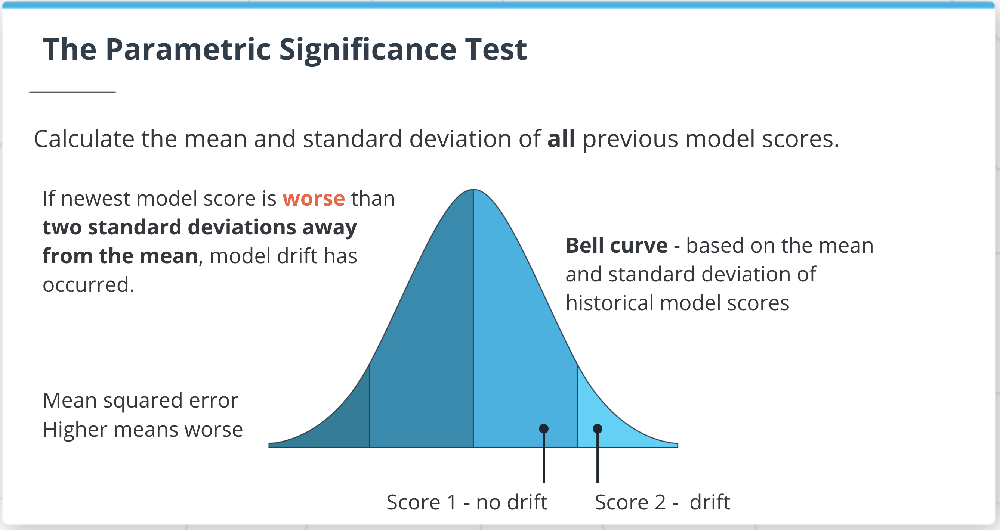

# Model Drift

## Model Drift and the Raw Comparison Test

### Summary
The term "model drift" refers to a model's performance getting worse over time. To test for model drift, we have to compare current model performance to previous model performance.

The simplest way to compare performance is a "raw comparison": we simply check whether current performance is worse than all previous scores. if the current performance score is worse than all previous scores, then we say that model drift has occurred - according to the raw comparison test.

## Parametric Significance Test

### Summary
In some cases, the raw comparison test is too sensitive, it will tell us that model drift occurred even in cases where the newest model is only very slightly worse than previous models.

In order to avoid this sensitivity, we can try a different test: the "parametric significance test." This test will check the standard deviation of all previous scores. Then, it will conclude that a new model has worse performance than previous models if the new model score is more than two standard deviations lower than the mean of all the previous scores.

You can see an illustration of the parametric significance test in the figure below.

[Perametric Significance Test](AI-Infrastructure/Practice/ML_DevOps/model_scoring_and_monitoring/model_scoring_and_model_drift/parametric_test.png)

A plot showing the parametric significance test: by checking whether the new score is more than two standard deviations from the mean of previous scores, the parametric significance test is meant to look for extreme values in a bell curve

### Non Parametric Significance Test
The parametric significance test relies on the standard deviation of previous scores. In some cases, the standard deviation can lead to misleading conclusions. This can be especially true if your data isn't distributed like a bell curve, or if it has many outliers.

In cases where we don't want to use the parametric significance test, we can use another, similar test called the "non-parametric outlier test." Instead of the standard deviation, this test uses the interquartile range: the difference between the 75th percentile and the 25th percentile. A model score is regarded as an extreme value if it is either:

more than 1.5 interquartile ranges above the 75th percentile (a high outlier)
more than 1.5 interquartile ranges below the 25th percentile (a low outlier)
If a model score is worse than previous scores to an extent that it's an outlier (either a high or low outlier), then the non-parametric outlier test concludes that model drift has occurred.

upperoutler > q75 + 1.5 * IQR

loweroutlier < q25 - 1.5 * IQR
