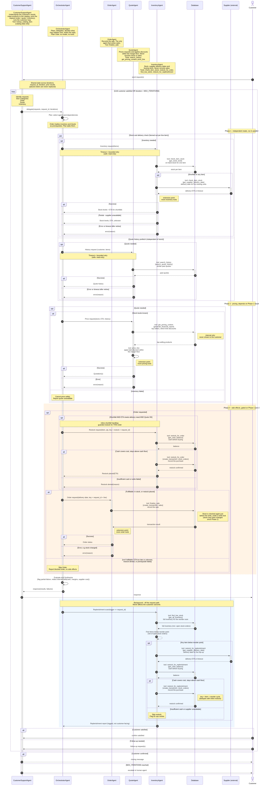

# Beavers Paper Company (Munder Difflin): Multi-Agent Ordering System

Customers send free-text requests ("I need 5,000 flyers by May 15"). Five agents work together to
understand the request, check stock, price it with bulk discounts, restock from the supplier when
needed, record the sale, and reply. Everything runs on a local SQLite database seeded from the CSV files.

- [Quick start](#quick-start)
- [Project layout](#project-layout)
- [The agents and where they live](#the-agents-and-where-they-live)
- [How a request flows](#how-a-request-flows)
- [Running the agents](#running-the-agents)
- [Running the tests](#running-the-tests)
- [Extending the system](#extending-the-system)
- [Troubleshooting](#troubleshooting)

## Quick start

Run everything from the **project root** (the folder that contains `main.py`).

```bash
pip install -r requirements.txt
echo "OPENAI_API_KEY=your-key-here" > .env

python main.py --limit 3 --no-sleep      # try the first 3 sample requests
python main.py                           # run all sample requests
python main.py --resume                  # carry on after a stopped run (see "Resuming a stopped run")
python tests/test_pipeline.py            # run the tests (no API key needed)
```

`python project_starter.py` does exactly the same as `python main.py` and accepts the same flags.

## Project layout

```
.
├── main.py                  entry point: parses flags, loads .env, runs the workflow
├── project_starter.py       8-line wrapper around main.py, so `python project_starter.py` still works
├── workflow.py              the test harness: run_test_scenarios(limit, no_sleep, resume), the loop over the requests
├── lib/                     the library
│   ├── agents.py            THE FIVE AGENTS + agent plumbing + get_model()
│   ├── tools.py             ALL TOOLS the agents can call (make_*_tools factories)
│   ├── config.py            policy knobs (discounts, cash reserve, retries) + load_env()
│   ├── models.py            LineItem, ParsedRequest, RequestContext (the per-request ledger)
│   ├── StateMachine.py      StateMachine: the state of a test run (start or resume, results, books, when to stop)
│   ├── policy.py            pure functions: pricing policy, fulfilment gate, parsing/validation
│   ├── database.py          CATALOG + once-only (idempotent) writes + retry helper
│   └── starter_utils.py     the starter's utility functions (database setup, stock, cash, reports)
├── utils/logs.py            the project's logger (`from utils import logger`)
├── tests/
│   ├── test_pipeline.py     the test suite (76 tests)
│   └── shims/smolagents/    a scripted stand-in model, used only by the tests
├── quote_requests.csv       seed data for the database (quote history)
├── quotes.csv               seed data for the database (past quotes)
├── quote_requests_sample.csv  the requests the harness runs
├── design_notes.txt         how the system works and why, and the reflection report (read this after the README)
├── beavers_agents_overview.mermaid / beavers_agents_detailed.mermaid   design diagrams (source)
├── beavers_agent.jpg / beavers_agent_sequence_detailed.jpg             design diagrams (images)
├── backup/                  the original single-file version and a map of where each function went
└── requirements.txt, pyproject.toml
```

Generated when you run things (safe to add to `.gitignore`): `munder_difflin.db`,
`test_results.csv`, `logs/`.

## The agents and where they live

All five agents are in **`lib/agents.py`**. All their tools are in **`lib/tools.py`**.

| Agent | Class | Uses an LLM? | What it does | Tools (factory in `lib/tools.py`) |
|---|---|---|---|---|
| Customer support | `CustomerSupportAgent` | yes | Turns the message into a structured request (items, quantities, deadline, intent) and runs the bounded customer loop | `make_customer_support_tools` → `lookup_catalog_item` |
| Orchestrator | `OrchestratorAgent` | **no**, plain Python | Plans, runs the phases, gates every side effect, retries, builds the reply, triggers background replenishment | none |
| Inventory | `InventoryAgent` | yes | Reads stock and supplier delivery dates; buys missing stock; keeps stock above reorder points | `make_inventory_read_tools` → `check_item_stock`<br>`make_inventory_restock_tools` → `restock_for_order`<br>`make_inventory_replenish_tools` → `find_low_stock`, `restock_for_replenishment` |
| Quote | `QuoteAgent` | yes | Looks up similar past quotes; prices each line with a bulk discount | `make_quote_history_tools` → `search_history`<br>`make_quote_pricing_tools` → `get_pricing_context`, `price_line` |
| Order | `OrderAgent` | yes | Records the sale (the only agent that writes one) | `make_order_tools` → `finalize_sale` |

### Tools and the starter helpers they use

Every starter helper is used inside at least one tool (a test checks this).

| Tool | Purpose | Starter helper(s) |
|---|---|---|
| `lookup_catalog_item` | map the customer's wording to catalog names | none (reads the catalog built from `paper_supplies`) |
| `check_item_stock` | stock on hand for one item, and the supplier's delivery date for any shortfall | `get_stock_level`, `get_supplier_delivery_date` |
| `restock_for_order` | buy the missing units so an approved order can ship | `get_cash_balance`, `get_supplier_delivery_date`, `create_transaction` |
| `find_low_stock` | list items below their reorder point | `get_all_inventory` |
| `restock_for_replenishment` | top up one low-stock item | `get_all_inventory`, `get_cash_balance`, `get_supplier_delivery_date`, `create_transaction` |
| `search_history` | find similar past quotes | `search_quote_history` |
| `get_pricing_context` | list prices and allowed discounts for the request | `generate_financial_report` |
| `price_line` | price one item within the allowed discount | none (pure pricing policy) |
| `finalize_sale` | record the sale | `create_transaction` |

Also in `lib/agents.py`: `SpecialistAgent` (base class), `build_agent`, `run_agent`, `run_until_covered`,
and `get_model()` (creates the model client on first use, so importing the package never needs a key).

**Least privilege:** each task gets only the tools it needs. The Phase-1 inventory task is handed read-only tools
and cannot write. Only `restock_for_order`, `restock_for_replenishment` and `finalize_sale` write to the database.

## How a request flows

Design diagrams: `beavers_agents_overview.mermaid` and `beavers_agents_detailed.mermaid`
(rendered as `beavers_agent.jpg` and `beavers_agent_sequence_detailed.jpg`).




1. **Understand.** `CustomerSupportAgent.categorize` asks the LLM for a structured request. `policy.validate_parsed`
   checks every item against the catalog, so the model cannot invent products. Unknown items are reported back.
   It also checks every quantity against the customer's own words: a quantity that is not a number the customer
   wrote (a count of reams counts as 500 sheets each) is never sold. The customer is asked to confirm it instead.
   A deadline earlier than the request date is flagged and the customer is asked to confirm it, never guessed.
   If the model call itself fails, the customer is told there is a temporary problem on our side (never "could not
   match"), and nothing is ordered.
2. **Plan.** `OrchestratorAgent.plan`: an order also needs a quote and a stock check; a quote needs a stock check.
3. **Phase 1, in parallel (reads only).** `InventoryAgent.check_stock` (stock plus the supplier's delivery date for
   any shortfall) runs alongside `QuoteAgent.prefetch_history`.
4. **Phase 2, pricing.** `QuoteAgent.price` applies a bulk discount within the caps in `lib/config.py`.
   Lines that need restocking are never discounted, top sellers get half the cap, and a margin floor always holds.
5. **Phase 3, side effects (gated).** If stock is short and the supplier can deliver before the deadline,
   `InventoryAgent.restock` buys the shortfall (never below the cash reserve). `OrderAgent.place_orders` then records
   the sale, checking the stock again just before the write. Blocked lines produce no writes at all.
6. **Reply.** Built from a template, so cash balances, margins and supplier costs can never leak to a customer.
7. **After the reply.** `InventoryAgent.replenish` tops up anything below its reorder point, off the request path.
8. **Loop.** If the customer follows up, steps 1-6 repeat (at most `MAX_ITERATIONS` times, then it escalates to a human).
   A follow-up that changes the quantity of an item already ordered is not applied: the item is never sold twice,
   and the customer is told a colleague will help change it.

What makes this safe to re-run: the Orchestrator never trusts the model's text, only the **ledger** that the tools
fill in (`RequestContext`); every write goes through the starter's `create_transaction` and carries an idempotency key, so retries and repeated requests cannot
double-sell or double-buy.

## Running the agents

### Setup

- Python (developed on 3.13) and the packages in `requirements.txt`. The code imports `pandas`, `numpy`,
  `sqlalchemy`, `python-dotenv` and `smolagents` (with the `openai` package, which `OpenAIServerModel` uses).
- A `.env` file **in the project root** containing `OPENAI_API_KEY=...`. It is loaded by `main.py`, from the project
  root regardless of your current directory.
- The three CSV files in the project root. The model name and endpoint are in `lib/agents.py` → `get_model()`.

### Run the whole sample

```bash
python main.py                    # or: python project_starter.py
```

| Flag | Meaning |
|---|---|
| `--limit N` | process only the first N requests (by date). Use this while developing: each request makes many model calls |
| `--no-sleep` | skip the 1-second pause the harness takes between requests |
| `--resume` | continue a stopped run (see below). Without this flag a run always starts over |

Each run **rebuilds** `munder_difflin.db` from the CSVs, so runs never affect each other (unless you pass `--resume`).
Per request it prints the request, the cash balance and inventory value before and after, and the reply.
`test_results.csv` is written after **every** request, so a run that stops or crashes keeps everything it finished.
It has the starter's five columns, `request_id, request_date, cash_balance, inventory_value, response`, followed by
three audit columns that let a reviewer reconcile the money without reading the database:
`order_total_confirmed` (what the customer was told was confirmed), `restock_cost` (spent buying stock for the order) and
`background_replenishment_cost` (spent on routine replenishment after the reply). For every request after the first,
the change in `cash_balance` equals `order_total_confirmed - restock_cost - background_replenishment_cost`;
`python tools/check_results.py test_results.csv quote_requests_sample.csv` checks it.

### Resuming a stopped run

If a run stops (the model went down, you pressed Ctrl-C, the machine crashed), carry on from where it stopped:

```bash
python main.py --resume            # or: python project_starter.py --resume
```

`--resume` keeps the existing database and `test_results.csv`, skips the requests already done, and continues with the
next one. It reuses the earlier run's id, so a request that was interrupted after its sale was written is recognised
and is **not sold a second time**. Rows at the end of the file that record a failure ("a temporary problem on our
side" or a crash) were never really processed, so they are redone.

It **refuses to resume** (with a message, and without changing anything) if it cannot be sure the state is intact: the
cash and inventory in the database must match the last saved row, the saved dates must match
`quote_requests_sample.csv`, and the database must hold the earlier run's id. In that case run without `--resume` to
start over. If there is nothing saved yet, `--resume` simply starts from the beginning.

Limits: only the failed rows at the **end** are redone (an earlier failure stays as it is, because redoing it later
would apply it out of date order), and `--resume` needs the same sample file and an untouched database.

Run from the project root: the CSV files, the database file and the `utils` package are found relative to it.

### Run a single request from Python

```python
from datetime import datetime

from lib import config
from lib.agents import CustomerSupportAgent, InventoryAgent, OrchestratorAgent, OrderAgent, QuoteAgent
from lib.database import ensure_runtime_tables
from lib.starter_utils import db_engine, init_database

config.load_env()                       # reads OPENAI_API_KEY from the project-root .env
init_database(db_engine)                # (re)creates munder_difflin.db from the CSVs
ensure_runtime_tables(reset=True)

run_id = datetime.now().strftime("%Y%m%d%H%M%S")
orchestrator = OrchestratorAgent(run_id, InventoryAgent(), QuoteAgent(), OrderAgent())
support = CustomerSupportAgent(orchestrator=orchestrator, run_id=run_id)

request = "I need 50 Cardstock by 2025-04-20 (Date of request: 2025-04-10)"
reply = support.handle(request, request_date="2025-04-10", request_id=1)
orchestrator.drain_background()         # optional: wait for the background replenishment
print(reply)
```

The reply looks like this (amounts depend on your data):

```
Thank you for your request (reference #1).
- 50 x Cardstock: $9.75 | CONFIRMED, delivery by 2025-04-10
Quote total: $9.75
Order total confirmed: $9.75
```

To let a customer answer back, pass `followup=callable(reply, iteration)` to `handle`. Return `None` when the customer
is satisfied, or their follow-up text.

### Tuning the behaviour (`lib/config.py`)

| Setting | Default | Meaning |
|---|---|---|
| `LIST_MARKUP` | `0.30` | list price = unit price × (1 + markup) |
| `MIN_MARGIN` | `0.10` | never sell below cost × (1 + margin) |
| `DISCOUNT_TIERS` | `(1000, 15%) (500, 10%) (100, 5%)` | maximum bulk discount by quantity |
| `HIGH_DEMAND_CAP_FACTOR` | `0.5` | top sellers get this fraction of the cap |
| `MIN_CASH_RESERVE` | `5000.0` | a restock may never push cash below this |
| `REORDER_TARGET_MULT` | `5` | replenish up to this multiple of the item's minimum stock |
| `ALLOW_PARTIAL_FULFILLMENT` | `True` | `False` = all-or-nothing per request |
| `MAX_ITERATIONS` | `3` | customer loop bound |
| `AGENT_MAX_STEPS`, `AGENT_TIMEOUT_S` | `8`, `120` | limits for each model run |
| `AGENT_RETRIES`, `DB_RETRIES`, `BACKOFF_S` | `1`, `3`, `0.3` | retry limits |
| `MAX_CONSECUTIVE_PARSE_FAILURES` | `3` | the harness stops after this many requests in a row whose parsing failed (results so far are saved) |
| `SHEETS_PER_REAM` | `500` | unit conversion for requests in reams |

In code, always read a setting as `config.NAME`. Never write `from lib.config import NAME`: that copies the value
when the module loads, so changes made at runtime (and by the tests) would silently have no effect.

## Running the tests

```bash
python tests/test_pipeline.py
```

Expected last line: `76/76 passed`. The script prints `PASS`/`FAIL` for each test (a failure prints its full traceback)
and exits with code 0 only if all pass. It is a plain script, not a pytest suite. A few `usage: ... error: --limit must be 1 or more` lines near the
start are expected: one test deliberately passes bad flags and checks they are rejected.

- **No API key, no network, no cost.** The tests use a scripted stand-in for the model
  (`tests/shims/smolagents/__init__.py`) that the test file loads by path. It must stay at exactly that path.
- **Safe for your data.** The tests run in a temporary folder with their own small CSVs and database. They never touch
  your `munder_difflin.db`, your CSVs, or `test_results.csv`.
- **What they cover:** pricing and discount rules, the fulfilment gate, request parsing and validation;
  in-stock orders; shortfall → restock → sale → background top-up; a supplier date after the deadline; insufficient
  cash; repeated requests (no double-selling or double-buying); model failures and skipped tool calls; partial vs
  all-or-nothing orders; the customer loop bound and escalation; unknown products; replies never leaking internals;
  least-privilege tool scoping; the write guards (stock check at sale, once-only writes including crash recovery,
  cash checks, cash formula); that every required starter helper is used inside a tool;
  the lazy model; the `--limit`/`--no-sleep`/`--resume` flags; a model failure being reported as a system problem
  (never as an unknown product); the run stopping after repeated failures while keeping the finished work; a follow-up
  that changes an item's quantity not selling it twice; discount caps halving when the financial report is down; and
  resuming (it ends exactly where an uninterrupted run ends, never sells an interrupted request twice, and refuses
  when the database, the saved results or the sample file no longer fit together).
- **What they do not cover:** how the real model behaves. They prove the plumbing and the guards, not the quality of
  the real LLM's parsing or discount choices. Check those with a real run (`python main.py --limit 3`).

## Extending the system

- **Add a tool.** Write it as a nested `@tool` function inside a `make_*_tools(ctx)` factory in `lib/tools.py`
  (the docstring needs an `Args:` entry for every parameter). Have it record its result in the ledger (`ctx`) and put
  any guard inside the tool, not in the prompt.
- **Give an agent the tool.** Return it from the factory the agent's method already uses, or add a new factory and
  call it from that agent's method in `lib/agents.py`. Keep read-only tasks on read-only factories.
- **Add a policy knob.** Define it in `lib/config.py` and read it as `config.NAME`.
- **Add a test.** Add an `@test` function in `tests/test_pipeline.py`.

## Troubleshooting

| Symptom | Likely cause and fix |
|---|---|
| `OpenAIError: The api_key client option must be set` | No key. Put `OPENAI_API_KEY=...` in `.env` in the project root |
| `Stopping: 3 requests in a row could not be understood because the model call failed` | The model calls are failing: a missing, rejected or expired key (an expired one arrives as `400 Invalid Key`), or no network. Check `OPENAI_API_KEY`, then rerun |
| `Cannot resume: ...` | `--resume` found that the database, `test_results.csv` and the sample file no longer fit together (the message says which). Run without `--resume` to start over |
| A reply says "a temporary problem on our side" | That one message's model call failed; nothing was ordered. If it keeps happening the run stops (previous row) |
| A reply says "We could not match these to products we sell" | The message named something that is not in the catalog. The listed words are the customer's own |
| `ModuleNotFoundError: No module named 'lib'` or `'utils'` | You are not running from the project root |
| `Argument ... is not in the tool's input schema` in the log | The model passed an argument a tool doesn't have. The agent normally corrects itself on the next step. If a request still fails, rerun it |
| Tests: `module 'smolagents' has no attribute 'HOOKS'` | The test file is not the current one, or the stand-in is missing. Check `tests/shims/smolagents/__init__.py` exists |
| Tests: `test stand-in missing` / `is not the test stand-in` | The stand-in file is missing, misnamed (it must be `__init__.py`) or empty |
